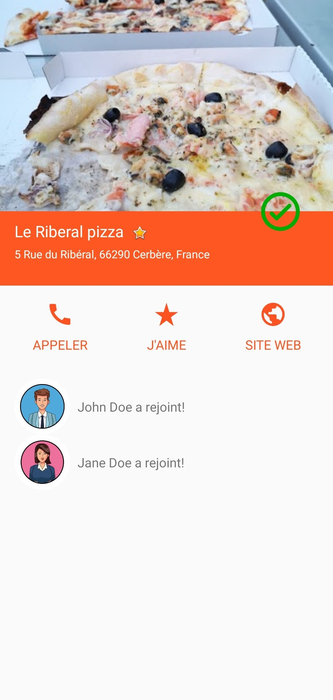

# OpenClassrooms - Go4Lunch

## Parcours développement d’application mobile - Projet 7

L’application Go4Lunch est une application collaborative utilisée par tous les employés. Elle permet de rechercher un restaurant dans les environs, puis de sélectionner celui de son choix en en faisant part à ses collègues. De la même manière, il est possible de consulter les restaurants sélectionnés par les collègues afin de se joindre à eux. Un peu avant l’heure du déjeuner, l’application notifie les différents employés pour les inviter à rejoindre leurs collègues.

## Sommaire
1. [Objectifs](#objectifs)
2. [Installation de l’application et de la Google cloud function](#installation)
3. [Application & Fonctionnalités](#application)

## Objectifs
Créer l’application de A à Z.

- Mettre en place une base de données en ligne NoSQL Firebase
- Mettre en place les moyens d’authentification (Email/Mot de passe, Facebook, Google puis Twitter
- Mettre en place les 3 fragments de l’accueil (Map, List, Workmates);
- Localisation
- Requête retrofit pour récupérer les données des restaurants selon la localisation
- Organisation et requête firestore
- Mettre en place la Google Map
- Restructurer le code de l’architecture MVC vers MVP
- Mettre en place la Google Cloud Function pour envoyer la notification
- Tester

## Installation

### Télécharger l’application

Le lien du projet est le suivant : git@github.com:Elyt622/Go4Lunch.git
Cliquez sur le bouton "Clone or Download"
Téléchargez le projet en cliquant sur "Download ZIP"

### Cloner l'application
Cloner le projet à partir d'un terminal avec la commande: "git clone git@github.com:Elyt622/Go4Lunch.git"

### Installation
Importer le projet dans Android Studio
Lancer le projet

### Installer la Google Cloud Function
Pour tester la notification envoyée à midi, il faut déployer la Google Cloud Function.

Configurer Node.js et la Command Line Interface Firebase

```
npm install -g firebase-tools
```

Aller dans le répertoire de la google function et exécuter la commande: 

```
firebase deploy --only functions
```

## Application
  

Écran d'accueil qui amène sur l'activité connexion si l'utilisateur n'est pas connecté. Il pourra se connecter ou s'inscrire dans les prochaines activités grâce à Facebook, Twitter, Google ou un simple email/Mot de passe grâce au SDK et à Firebase authentification.

 

Demande d'autorisation de localisation avec l'utilisation des permissions pour localiser l'utilisateur sur la carte et proposer les restaurants alentour. Le bouton en haut à droite permet de zoomer sur la position de l'utilisateur. Une requête retrofit est exécutée pour obtenir les restaurants à proximité avec l'API Google Place. On stocke les résultats dans Firestore. On peut cliquer sur les restaurants affichés sur la carte pour afficher les détails. 

 

Barre de recherche disponible, les résultats retournés sont ceux de la Google Place API, tous les lieux à proximité sont affichés pour une recherche, mais seulement les restaurants sont cliquables. Un toast est utilisé pour afficher un message s'il ne s'agit pas d'un restaurant.

 

Les restaurants sont affichés sous forme de liste avec les informations utiles et les participations. Les collègues sont montrés avec leur participation active. Il y a la possibilité de cliquer sur les restaurants pour afficher les détails ou sur les collègues pour afficher les restaurants auxquels ils participent.
 
  

L'écran de détail d'un restaurant affiche les informations de celui-ci puis tous les participants. On peut mettre en favoris un restaurant, l'enlever des favoris, ajouter notre participation et enfin comme on peut le voir ci-dessous consulter le site web ou appeler.

 

Et pour finir, grâce au menu nous pouvons afficher notre restaurant sélectionné si nous avons une participation active, voir les paramètres du smartphone ou simplement se déconnecter. 
